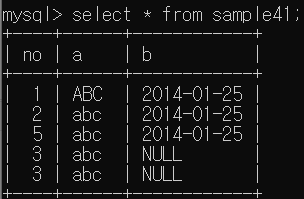
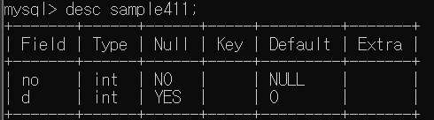
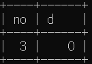

# 2022-04-20

## chap 16 행 추가하기

###INSERT 명령
```
INSERT INTO tableName VALUES(val1, val2, ...);
```

###INSERT 열지정
```
INSERT INTO tableName(col1, col2, ...) VALUES(val1, val2, ...);
```
**채우지 않은 column의 value의 default는 NULL이다.**
**만약 테이블 생성시 컬럼 제약으로 NOT NULL을 걸었다면 불가능**



###DEFAULT

desc로 열 구성을 확인 할 때 default를 확인 할 수 있다.

```
INSERT INTO tableName(no,d) VALUES(2,DEFAULT);
``` 
```
INSERT INTO tableName(no,d) VALUES(3); 
```
이런 식으로 값을 정해주지 않아도 default로 insert되는 것을 확인 할 수 있다.



