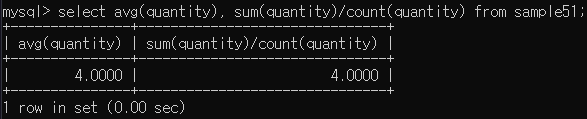
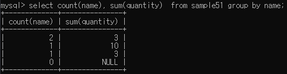

# 2022-04-21

## 🔥Chap 21 행 추가 하기  

### -SUM으로 합계 구하기  
```
## SELECT 함수도 COUNT와 마찬가지로 NULL값을 무시합니다.
SELECT * FROM databases;
```  
### -AVG로 평균 내기  
```
SELECT AVG(column), SUM(column)/COUNT(column) FROM DATABASES;  
## 이때 NULL은 0으로 치지 않고, 0을 무시한다.
```  
  
  
```
##만약 NULL을 0으로 치고 계산을 하고 싶다면 다음과 같이 하면 된다.  
SELECT AVG(CASE WHEN quantity IS NULL THEN 0 ELSE quantity END) AS avgnull0 FROM sample51;
```  

## 🔥Chap 22 그룹화 - GROUP BY  
### -GROUP BY로 그룹화
```
SELECT name FROM sample51 GROUP BY name;
## 이 경우 distinct와 다를것이 없는데 집계함수와 같이 사용해야 차이점을 볼 수 있다.
```  
  
  
```
SELECT name, COUNT(name), SUM(quantity) FROM sample51 GROUP BY name;
```  
  
### -HAVING 구로 조건 지정
  
- 집계함수는 WHERE 구의 조건식에서는 사용할 수 없다.  
- 에러가 발생하는 이유는 GROUP BY와 WHERE구의 내부 처리 순서 때문인데,  
  WHERE구로 조건을 검색하는 순서가 그룹화 하는것보다 빠르게 동작되기 때문이다. 
```
SELECT name, COUNT(name) FROM sample51 GROUP BY name HAVING COUNT(name) = 1;  
  
  
##내부처리 순서  
WHERE구 > GROUP BY구 > SELECT구 > ORDER BY구  
>>다만 SELECT구 보다도 먼저 처리 되므로 별명을 사용할 수는 없다.  
select name as n, count(name) as cn from sample51 group by n having cn =1;  
## 같은 구문을 말하는건데.. Oracle에서는 안되지만 Mysql에선 됨..
```  
### - 복수열의 그룹화  
```
select no,name,quantity from sample51 group by name;  
>> name은 그룹화 되어있지만, no와 quantity는 집계함수를 사용하지 않은채로 이 쿼리를 실행 할 수는 없다.  
>> 두개 이상의 값이 있는 경우 무슨 값을 표시 할지 모르기 때문에.  
select min(no),name,sum(quantity) from sample51 group by name; >> 이런식으로 해주어야 함
```  

### - 결과값 정렬
```
select name, count(name),sum(quantity) from sample51 group by name order by sum(quantity) desc;
와 같이 정렬 할 수 있다. 기본값은 ASC!!
```

## 🔥Chap 23 서브쿼리
### DELETE의 WHERE구에서 서브쿼리 사용하기
```
delete from sample54 where a=(select min(a) from sample54;)
```  
  
### -스칼라 값
- 서브쿼리를 사용 할때, 그 select 명령이 어떤 형태로 값을 반환하는지에 주의해야한다.  
#### **select 명령이 하나의 값만 반환하는 것을 스칼라 값을 반환한다 라고 한다.**  

### SELECT구에서 서브쿼리 사용하기
```
select  
    (select count(*) from sample51) as sq1,  
    (select count(*) from sample51) as sq2;
    >> Mysql에서는 이것처럼 from을 생략 가능하지만, oracle에서는 from dual로 지정 하면 실행 할 수 있다.  
      
select  
    (select count(*) from sample51) as sq1,  
    (select count(*) from sample51) as sq2 from dual;      
```  
  
### SET구에서 서브쿼리 사용하기
  
```
update sample54 set a = (select max(a) from sample54);  
>>mysql에서는 데이터를 추가하거나 갱신할 경우 동일한 테이블을 서브쿼리에서 사용할 수 없도록 되어있어서 에러가 나온다..
```  


